# K-means and K-means++

## Introduction:
機器學習相較於傳統由程式設計師訂定方法，而是透過以往的規則或是資料，使機器自行找到其運行規則。而其演算法分為四類，監督式學習、非監督式學習、強化學習以及遷移學習。本篇採用是非監督式學習中的K-means分群法以及其改善方法，並以UCI中的Iris和Abalone為測試資料集。

## Method:
a) K-Means
1.	預設群數量。
2.	隨機初始化K個群中心。
3.	計算所有資料點分別到K個群中心距離，每個資料點依序從K個距離中選最短距離，代表該資料點屬於該群。
4.	透過該群所有資料成員，重新計算出重心，並以此為該群新的群中心。
5.	重複步驟3到5，直到所有資料點不再變動其所屬群，或達到初始設定最大次數上限。

b) K-Means++
1.	預設群數量，初始化N為1。
2.	隨機初始化1個群中心。
3.	計算所有資料點到所有群中心的距離，每個資料點從N個距離中選最短距離並給予機率權重。
4.	透過機率權重以及輪盤法，求得新的群中心，N加1。
5.	重複步驟3到5，直到N等於K。
6.	計算所有資料點分別到K個群中心距離，每個資料點依序從K個距離中選出其最小，代表該資料點屬於該群。
7.	透過該群所有資料成員，重新計算出重心，並以此為該群新的群中心。
8.	重複步驟6到8，直到所有資料點不再變動其所屬群，或達到初始設定最大次數上限。


## Specification:
### Input:
```
1. 選擇資料集
2. 選擇演算法
3. 運行次數
4. K範圍
```
### Output:
```
1. 當前K值
2. 收斂花費迭代
3. 花費時間
4. 輪廓係數，表樣本與同類別距離相近，不同類別距離遠離的程度，範圍[-1,1]
5. 平方誤差總和，表資料點和群中心的離散程度
6. 不同數量分群時間(圖)
7. 不同數量分群輪廓係數(圖)
8. 不同數量分群平方誤差總和(圖)
```

## Manual:
- 資料集必須與程式相同資料夾

## Simulation Result:

### Environment:
- OS: Windows 10
- CPU: i7-6700HQ
- RAM: 8G
- Compiler: Python 3

### K-means(Iris)
Simulation time = 10

**Time(sec) of cluster (Fig. 1.)** </br>
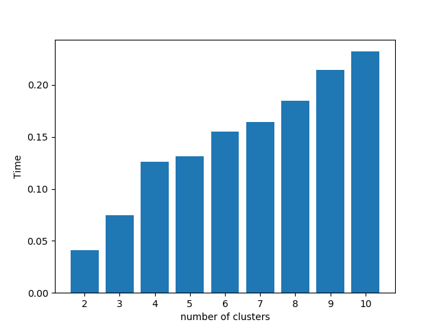 </br>
**Silhouette_score of cluster (Fig. 2.)** </br>
 </br>
**Sum_of_square_error of cluster (Fig. 3.)** </br>
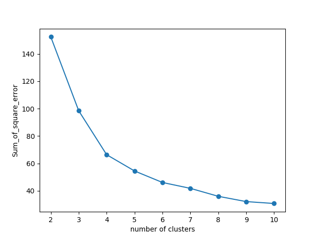 </br>

### K-means++(Iris)
**Time(sec) of cluster (Fig. 4.)** </br>
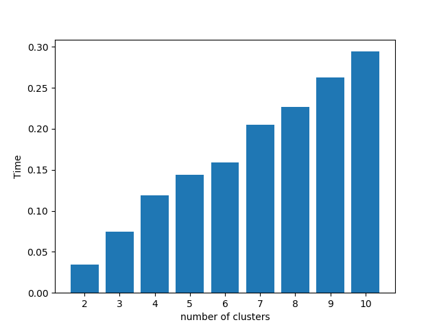 </br>
**Silhouette_score of cluster (Fig. 5.)** </br>
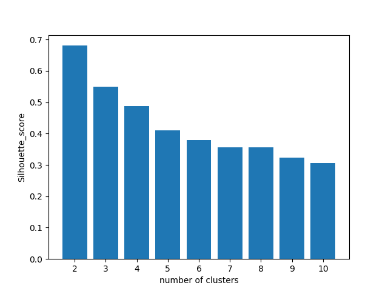 </br>
**Sum_of_square_error of cluster (Fig. 6.)** </br>
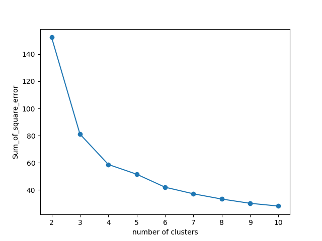 </br>

在Iris dataset中，使用K-means及K-means++進行分群，均會因為群數量導致時間成長。而由於Iris實際群數為3群，因此使用2或3群進行分群，從輪廓係數來看，均能得到不錯效果。由於K-means++在初始群心的部分改善隨機選擇的缺點，以3群為標準，平方誤差總和在K-means++上比K-means有更好的表現。

### K-means(Abalone)
**Time(sec) of cluster (Fig. 7.)** </br>
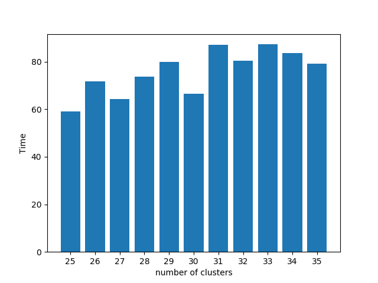 </br>
**Silhouette_score of cluster (Fig. 8.)** </br>
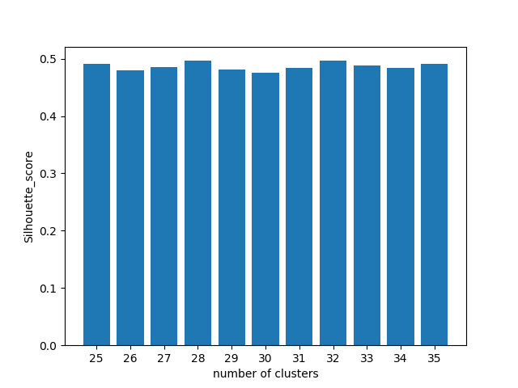 </br>
**Sum_of_square_error of cluster (Fig. 9.)** </br>
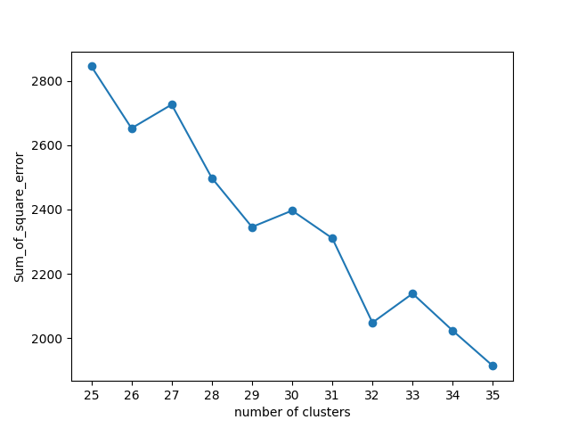 </br>

### K-means++(Abalone)
**Time(sec) of cluster (Fig. 10.)** </br>
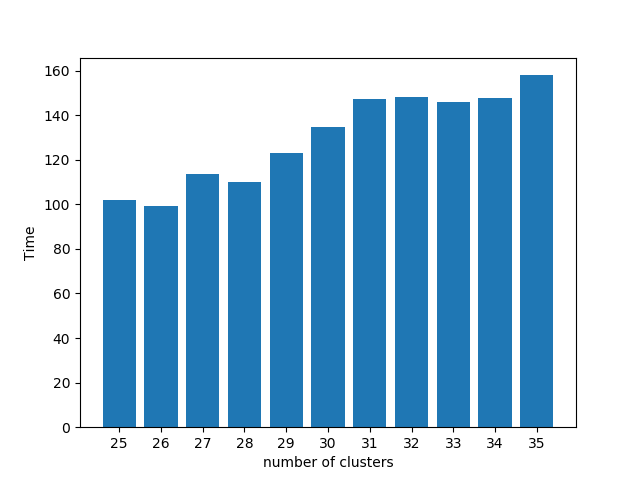 </br>
**Silhouette_score of cluster (Fig. 11.)** </br>
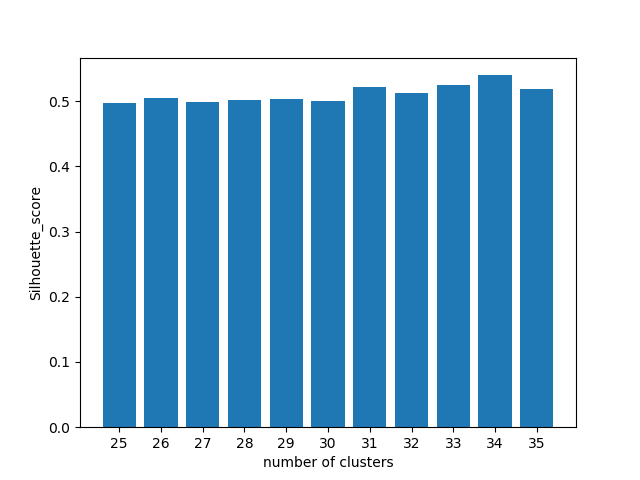 </br>
**Sum_of_square_error of cluster (Fig. 12.)** </br>
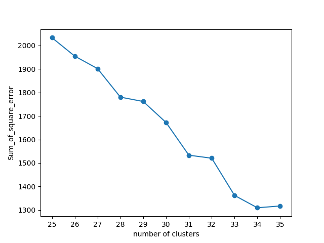 </br>

在Abalone dataset中，使用K-means及K-means++進行分群，同樣因為群數量導致時間成長，且由於資料點圍度以及總數較大，因此時間相較於Iris多許多。Abalone實際為29群，從輪廓係數來看並無法準確判斷群數。而K-means++在Abalone平方誤差總和的表現更能看出其改善K-means的缺點部分。

## Conclusion:
由於K-means以及K-means++是屬於直接透過距離的分群演算法，因此在對Iris這種能透過線性分群的dataset來說，效果還算不錯；但對Abalone這種線性不可分且資料點圍度以及總數較大的dataset來說，就不是這麼適合。且在我們所處的自然中，大多都和Abalone情況相同，因此K-means和K-means++並不實用。

---
## License and copyright
© Jerry Cheng